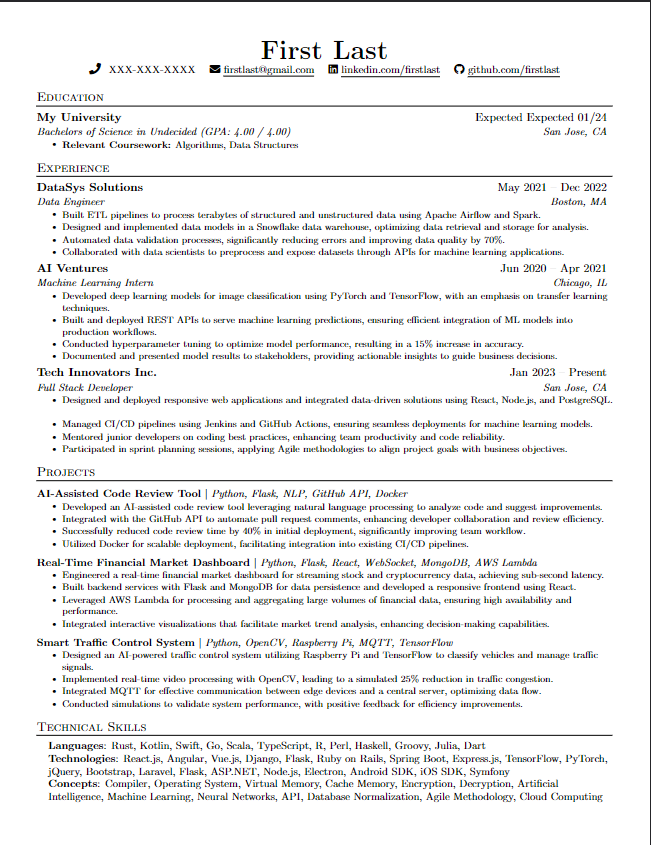

# ResuMate - Resume Customization using AI Agents

### Here's an example of a resume generated using my application:

To view the user-data and job description that was passed into the customizer program that generated the resume above, please navigate to the following files: 
- `data/test_data.json`
- `data/job_description.txt`

### Project Timeline (TODOs)
- [ ] Create requirements.txt and write instructions on how to install conda environment
- [ In Progress ] Finish up Readme.md, explaining how to use this awesome tool
- [ In Progress ] Create elegant website UI, enable users to sign-in using oAuth
- [ ] Modify Autogen configurations to use Groq API
      - Much cheaper than OpenAI API
      - Faster inference speed

Long Term:
- [ ] Host on a cloud server 
